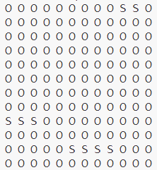
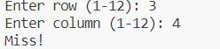
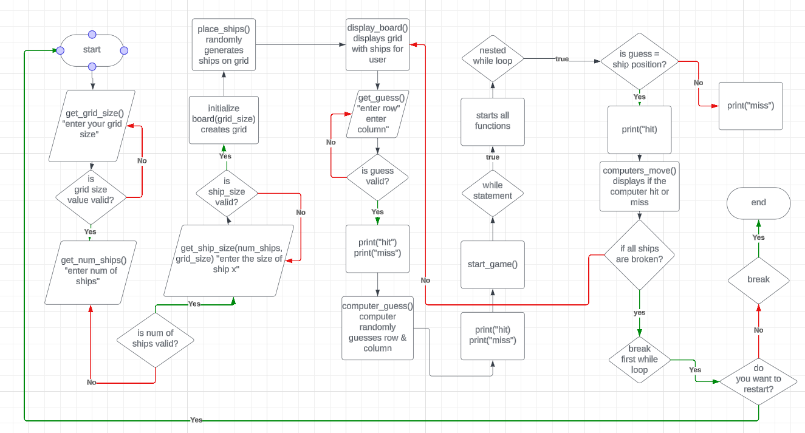
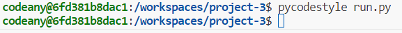
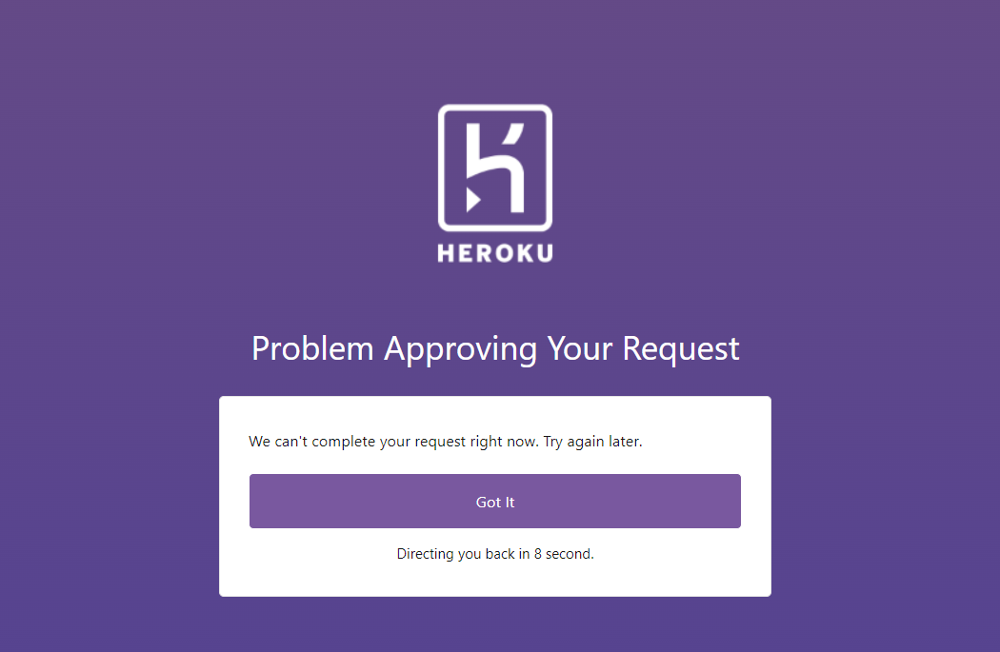

<h1>A battleship game<h1>

this is a python program that makes a simple game against the computer 

# features 

## the game board

<h2></h2>

this is the main board for our battleship game , the S mean your ship , the length of the size is equals to the size of
your ship

## the guessing feature 

<h2></h2>

the guess feature is a basic feature that allows the user to guess where the computers boats are and will tell you if you hit
or missed it 

## the computers move

<h2></h2>

the computers move is essntially a feature that tells you the computers move and tells the user if the hit or miss
this was added to give the user a better idea of whats happening in the game 

## restart 

<h2></h2>

the restart function essentially just allows the user to restart the gaem if they so choose to without re-running the program

# Features left to impliment

there is little that i wanted to impliment in this game that i couldnt and those things were:

<ul>

<li>A score system for when you or the computer wins this could be done by adding a simple incrementer </li>

<li>because its a terminal based program i couldnt make a better grid for the battleships using tkinter</li>

# Languages Used

[Python](https://www.python.org/)

# flowchart 

this was a basic flowchart i made on [lucidchart](https://www.lucidchart.com/pages/landing?utm_source=google&utm_medium=cpc&utm_campaign=_chart_en_tier1_mixed_search_brand_exact_&km_CPC_CampaignId=1490375427&km_CPC_AdGroupID=55688909257&km_CPC_Keyword=lucidchart&km_CPC_MatchType=e&km_CPC_ExtensionID=&km_CPC_Network=g&km_CPC_AdPosition=&km_CPC_Creative=354596043016&km_CPC_TargetID=kwd-33511936169&km_CPC_Country=9180610&km_CPC_Device=c&km_CPC_placement=&km_CPC_target=&gad_source=1&gclid=CjwKCAiAuYuvBhApEiwAzq_YiXfaDgcjum3hzgmg9sC3hnTScl3aSIgnHbm2kQdLkMpJQVO2Dh04DxoCgp8QAvD_BwE)

i made this basic chart to give myself some sort of basic idea for my project 

<h2></h2>

# validators 

the validators i used were pep8 (which forced me to use pycodestyle)

and the result are :

<h2></h2>

no errors when running it 

# bugs that arent fixed 

mainly the entire issue ive had with heroku is that i CANNOT deploy my project live , ive spent alot of hours trying to use google cloud , pythoneverywhere , replit and other things to replace this and i could not 

<h2></h2>

# credits 

this youtube video [here](https://www.youtube.com/watch?v=CP1j6gM4jSo)

gave me a good idea of how i could make a grid on a terminal 

this youtube video [here](https://www.youtube.com/watch?v=Ej7I8BPw7Gk&list=PLpeS0xTwoWAsn3SwQbSsOZ26pqZ-0CG6i)

this playlist also gave me alot of insperation on how to build this 

the rest was me reusiing code from the python essentials to get my way around some issues 

# libaries and tools used 

the libary [random](https://docs.python.org/3/library/random.html)

the library [pycodestyle](https://pypi.org/project/pycodestyle/)